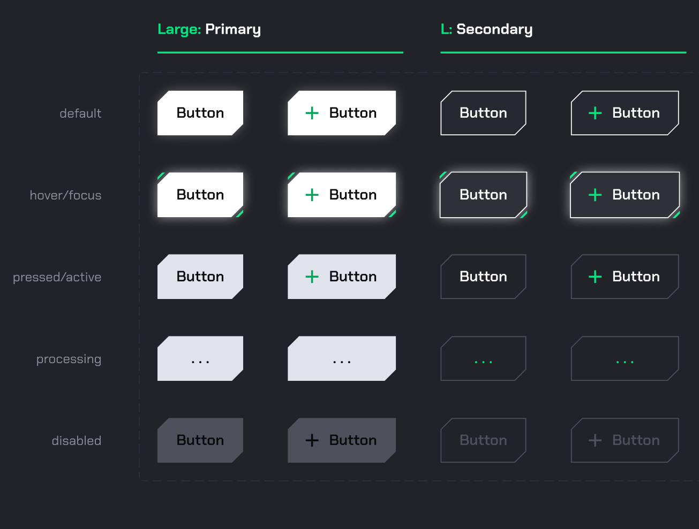

# ui-kit-buttons

## Test

Create Vue button component:

- [ ] "text" property for button label
- [ ] "primary", "secondary" css style classes
- [ ] "focus", "active", "processing", "disabled" props state
- [ ] icon-start, icon-end, icon-only slots for icon

## Resources

- assets/DNA Tech FZ LLC - Buttons.fig
- assets/Screenshot 2022-01-21 at 15.26.37

## Knowledge Checking

- Vue
- HTML
- CSS
- Git
